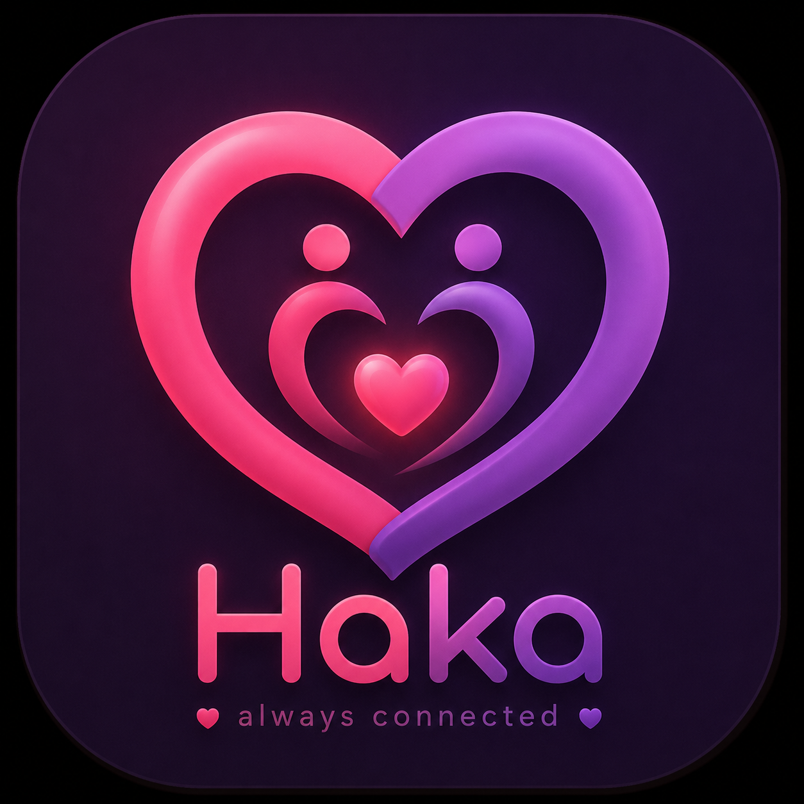

  

  # Haka

  **A private shared-heart experience for two people, built natively for Android and iOS.**

  
  
  
  
  
  

  [Features](#features) · [Architecture](#architecture) · [Setup](#local-development) · [Testing](#testing) · [Security](#security-and-privacy)

---

## Overview

Haka gives a couple one shared, living heart. Either partner can tap it, both clients receive the authoritative shared state, and the heart gradually loses energy unless they keep participating together.

The product is intentionally private and focused:

> Open Haka, see your shared heart, send a little love, and know your partner can feel it.

Haka is not a public social network or a general-purpose chat app. Each authenticated user belongs to one active couple, and each couple contains exactly two members.

## Release status

| Item | Current value |
| --- | --- |
| Product version | **2.2.0** |
| Build number | **8** |
| Android minimum | Android 8.0 / API 26 |
| iOS minimum | iOS 16 |
| Backend | Supabase PostgreSQL, Auth, Edge Functions, Realtime, and Storage |
| Android notifications | Firebase Cloud Messaging |
| iOS notifications | Simulator payload testing; production APNs integration requires Apple credentials |

The Android app and native iOS simulator app share the same Supabase project and backend state machine.

## Features

### Shared heart

- One authoritative heart per couple
- Live partner tap updates
- Linear time-based decay
- Idempotent tap commands and retry-safe processing
- Per-user and combined daily tap totals
- Current and longest streak tracking
- Haptic tap feedback, floating-heart particles, liquid fill, and full-heart celebration
- Android and iOS home-screen widgets

### Emotional connection

- **Thinking of You** partner nudge
- Private Love Notes
- Daily Mood sharing
- Partner activity notifications
- Private, couple-only visibility

### Our Story

- Shared memories with captions, dates, and photo albums
- Standalone bucket-list items
- Named shared bucket lists
- Completion tracking
- Important relationship dates
- Anniversary, birthday, and custom-date reminders
- Full create, edit, and delete flows

### Insights

- Today’s combined progress
- Per-partner contribution breakdown
- Current and longest streaks
- Seven-day activity chart
- Private daily summaries
- Dynamic history sourced from the backend

### Identity and recovery

- Anonymous Supabase Auth for low-friction onboarding
- Google identity linking for account recovery
- One-time, expiring invite codes
- Persistent couple membership across reinstall or device migration after linking

## Platform parity

| Capability | Android | iOS |
| --- | :---: | :---: |
| Anonymous and Google authentication | ✅ | ✅ |
| Create or join a couple | ✅ | ✅ |
| Shared heart and authoritative taps | ✅ | ✅ |
| Automatic in-app decay display | ✅ | ✅ |
| Thinking of You | ✅ | ✅ |
| Love Notes and Daily Mood | ✅ | ✅ |
| Insights and daily history | ✅ | ✅ |
| Memories, bucket lists, and dates | ✅ | ✅ |
| Home-screen widget | ✅ | ✅ |
| Narrow-screen responsive layout | ✅ | ✅ |
| Offline tap queue | ✅ | — |
| Production partner push delivery | ✅ | Requires APNs credentials |
| Simulator notification presentation | N/A | ✅ |

Android receives backend state through Supabase Realtime and repository refreshes. The current iOS client refreshes authoritative state every two seconds while open and renders decay locally from the server timestamp.

## Heart rules

The heart uses integer score units to keep all calculations deterministic:

~~~text
Maximum score: 10,000 points
Accepted tap:  +25 points
Decay:         -100 points per completed 30-second interval
Range:         0...10,000
~~~

This is linear decay:

- 1 tap = +0.25%
- 4 taps = +1%
- 1 completed 30-second interval = -1%
- Tapping does not reset the decay boundary

The backend applies accumulated decay lazily using server time before accepting a command. Clients can animate the effective score between network updates, but they never become authoritative.

## Navigation

~~~text
Heart       Shared heart, tapping, connection state, and Thinking of You
Insights    Today’s progress, contribution split, streaks, charts, and history
Love        Love Notes, Daily Mood, and Thinking of You
Us          Memories, bucket lists, and important relationship dates
Settings    Identity recovery, notifications, privacy, and sign out
~~~

## Architecture

~~~mermaid
flowchart LR
    subgraph Clients
        A[Android: Compose, Room, Glance]
        I[iOS: SwiftUI, WidgetKit]
    end

    A --> AUTH[Supabase Auth]
    I --> AUTH
    A --> EDGE[Authenticated Edge Functions]
    I --> EDGE
    EDGE --> RPC[Security-definer PostgreSQL RPCs]
    RPC --> DB[(PostgreSQL)]
    RPC --> STORAGE[(Private Storage)]
    DB --> RT[Realtime changes]
    RT --> A
    EDGE --> FCM[FCM HTTP v1]
    FCM --> A
~~~

### Trust boundary

The clients render state and submit commands. The backend owns every value that affects trust:

- Couple membership and partner identity
- Heart score, timestamps, and decay
- Tap attribution and totals
- Daily completion and streaks
- Invite validity and consumption
- Idempotency and rate limiting
- Love Notes, moods, memories, dates, and reminders
- Notification eligibility and throttling

### Android stack

- Kotlin
- Jetpack Compose and Material 3
- Hilt
- Coroutines and StateFlow
- Room
- WorkManager
- Jetpack Glance
- Firebase Cloud Messaging
- Supabase Kotlin SDK

### iOS stack

- Swift 5.10
- SwiftUI
- Swift Charts
- WidgetKit
- PhotosUI
- AuthenticationServices
- Keychain-backed Supabase session storage
- Native URLSession Supabase Auth and Edge Function client
- XcodeGen project definition

### Backend stack

- Supabase PostgreSQL
- Supabase Auth
- Supabase Edge Functions
- PostgreSQL security-definer RPC functions
- Row-Level Security
- Supabase Realtime
- Private Supabase Storage
- FCM HTTP v1 for Android push delivery

## Repository structure

~~~text
.
├── app/                         # Native Android application
│   └── src/main/java/com/haka/app/
│       ├── core/                # Models, theme, networking, notifications
│       ├── data/                # Repository, Room, and settings
│       ├── feature/             # Auth, Heart, Insights, Love, Us, Settings
│       ├── widget/              # Jetpack Glance widget
│       └── work/                # Offline tap retry
├── ios/                         # Native iOS application
│   ├── Haka/
│   │   ├── App/                 # App lifecycle, root state, navigation
│   │   ├── Core/                # API, models, auth session, design system
│   │   ├── Features/            # Auth, Heart, Insights, Love, Us, Settings
│   │   └── Resources/           # Assets, entitlements, Info.plist
│   ├── HakaWidget/              # WidgetKit shared-heart widget
│   ├── PushPayloads/            # Simulator notification fixtures
│   ├── Tests/                   # iOS unit tests
│   └── project.yml              # XcodeGen source of truth
├── supabase/
│   ├── functions/               # Authenticated Edge Functions
│   ├── migrations/              # Schema, RPC, RLS, Realtime, features
│   └── tests/                   # Database tests
├── functions/                   # Original Firebase backend reference
├── scripts/                     # Backend smoke tests and utilities
└── .github/workflows/           # Continuous integration
~~~

## Backend functions

| Function | Responsibility |
| --- | --- |
| create-couple | Creates a couple, initializes state, and issues an invite |
| redeem-invite | Validates and consumes a one-time invite |
| get-bootstrap | Returns identity, couple, heart, day, streak, and history |
| tap-heart | Applies decay, processes an idempotent tap, and updates totals |
| register-device | Stores Android FCM tokens and notification preferences |
| thinking-of-you | Records a rate-limited nudge and notifies the partner |
| send-love-note | Stores a private note and triggers partner notification |
| get-love-notes | Returns the couple’s recent private notes |
| set-mood | Stores the authenticated user’s current daily mood |
| get-mood | Returns both partners’ current daily moods |
| relationship-story | Manages memories, albums, bucket lists, and important dates |

## Local development

### Prerequisites

- Git
- JDK 17
- Android Studio with Android SDK 35
- Xcode 16 or newer
- XcodeGen
- Node.js 22
- Supabase CLI
- A Supabase project
- A Firebase Android app for production Android notifications

### Clone

~~~bash
git clone git@github.com:HARSHXICOR/HAKA-.git
cd HAKA-
npm install
~~~

### Android configuration

Create or update the ignored <code>local.properties</code>:

~~~properties
sdk.dir=/absolute/path/to/Android/sdk
SUPABASE_URL=https://YOUR_PROJECT_REF.supabase.co
SUPABASE_ANON_KEY=YOUR_PUBLISHABLE_OR_ANON_KEY
~~~

Use only a Supabase publishable/anon key in a client application. Never use a service-role key.

For Android push delivery, download Firebase’s <code>google-services.json</code> and place it at:

~~~text
app/google-services.json
~~~

Build the debug APK:

~~~bash
JAVA_HOME=/path/to/jdk-17 ./gradlew :app:assembleDebug --no-daemon
~~~

The APK is produced at:

~~~text
app/build/outputs/apk/debug/app-debug.apk
~~~

### iOS simulator configuration

Install XcodeGen:

~~~bash
brew install xcodegen
~~~

Create the ignored local configuration:

~~~bash
cp ios/Config/Secrets.xcconfig.example ios/Config/Secrets.xcconfig
~~~

Add the same public Supabase client values used by Android:

~~~xcconfig
SUPABASE_URL = https:/$()/YOUR_PROJECT_REF.supabase.co
SUPABASE_ANON_KEY = YOUR_PUBLISHABLE_OR_ANON_KEY
~~~

The <code>$()</code> segment is intentional: it prevents <code>//</code> from being interpreted as an xcconfig comment.

Generate and open the project:

~~~bash
cd ios
xcodegen generate
open HakaIOS.xcodeproj
~~~

Select the **Haka** scheme and an iPhone Simulator, then run the app.

Google OAuth requires this redirect URL in the Supabase Auth allow list:

~~~text
haka://auth/callback
~~~

An Apple Developer membership is not required for simulator builds, Supabase authentication, pairing, taps, the five app tabs, WidgetKit development, or simulated notification presentation.

### Supabase deployment

Authenticate and link the target project:

~~~bash
npx supabase login
npx supabase link --project-ref YOUR_PROJECT_REF
~~~

Apply every migration:

~~~bash
npx supabase db push --linked --include-all
~~~

Deploy the Edge Functions:

~~~bash
npx supabase functions deploy \\
  create-couple redeem-invite get-bootstrap tap-heart register-device \\
  thinking-of-you send-love-note get-love-notes set-mood get-mood \\
  relationship-story \\
  --project-ref YOUR_PROJECT_REF --use-api
~~~

For Android FCM delivery, store the Firebase Admin service-account JSON as a server-side Supabase secret:

~~~bash
npx supabase secrets set \\
  FIREBASE_SERVICE_ACCOUNT_JSON='YOUR_SERVICE_ACCOUNT_JSON' \\
  --project-ref YOUR_PROJECT_REF
~~~

Never commit this credential or ship it in either mobile app.

## Notifications

### Android

Supabase Edge Functions send FCM HTTP v1 messages for:

~~~text
partner_tap
thinking_of_you
love_note
relationship_date
~~~

The Android client registers its FCM token through <code>register-device</code> and supports foreground and background notification presentation.

### iOS simulator

The iOS simulator can verify notification UI without an Apple Developer membership:

~~~bash
xcrun simctl push booted com.haka.app.ios ios/PushPayloads/thinking-of-you.apns
xcrun simctl push booted com.haka.app.ios ios/PushPayloads/love-note.apns
~~~

Real partner-to-iPhone delivery requires:

1. Apple Developer Program membership
2. An App ID with Push Notifications
3. An APNs authentication key
4. A Firebase iOS app and APNs key upload
5. Firebase Messaging token registration in the iOS client

Supabase remains the application backend, but Apple still requires remote iOS notifications to travel through APNs.

## Testing

### Android

~~~bash
./gradlew :app:assembleDebug --no-daemon
~~~

### iOS build

~~~bash
cd ios
xcodegen generate
xcodebuild \\
  -project HakaIOS.xcodeproj \\
  -scheme Haka \\
  -configuration Debug \\
  -destination 'generic/platform=iOS Simulator' \\
  CODE_SIGNING_ALLOWED=NO \\
  build
~~~

### iOS unit tests

~~~bash
xcodebuild \\
  -project ios/HakaIOS.xcodeproj \\
  -scheme Haka \\
  -destination 'platform=iOS Simulator,name=iPhone 17 Pro' \\
  CODE_SIGNING_ALLOWED=NO \\
  test
~~~

### Local Supabase database

Docker must be running:

~~~bash
npm run supabase:start
npm run supabase:reset
npm run test:supabase
npm run supabase:lint
~~~

### Production smoke test

Use temporary environment variables and a dedicated test couple:

~~~bash
SUPABASE_URL=https://YOUR_PROJECT_REF.supabase.co \\
SUPABASE_ANON_KEY=YOUR_ANON_KEY \\
SUPABASE_SERVICE_ROLE_KEY=YOUR_SERVICE_ROLE_KEY \\
npm run smoke:supabase
~~~

The smoke suite covers authentication, pairing, authorization, idempotent taps, decay, daily completion, streaks, Love Notes, Daily Mood, and cleanup.

### Manual two-client acceptance test

1. Sign in on two independent app installations.
2. Create a couple on client A.
3. Redeem the invite on client B.
4. Confirm client A leaves the invite screen automatically.
5. Tap either heart and confirm both clients update.
6. Wait 30 seconds and confirm both clients show the 1% decay.
7. Send Thinking of You and a Love Note.
8. Share a mood, memory, bucket item, and important date.
9. Restart both clients and confirm the same couple and state return.
10. Link Google and verify identity recovery before changing devices.

## Security and privacy

Haka follows an authoritative-backend model:

- RLS is enabled on public data tables
- Clients cannot directly write authoritative heart, couple, streak, or daily state
- Membership is checked inside backend RPC functions
- Invite codes are one-time and expire
- Tap IDs make retries idempotent
- Server time controls decay and daily rollover
- Sensitive feature data lives behind authenticated Edge Functions
- Relationship photos use private storage and expiring signed URLs
- Rate limits protect taps, nudges, and notes
- Service-role and Firebase Admin credentials remain server-only
- Local client configuration files are ignored by Git
- Notification failures never roll back an accepted relationship event

Invite codes are pairing credentials, not account-recovery credentials. Device recovery must use a linked Google identity.

## Release checklist

- Confirm version name and build number on both platforms
- Confirm the intended Supabase project is selected
- Apply all database migrations
- Deploy every required Edge Function
- Verify RLS, storage policies, and function JWT enforcement
- Confirm Android <code>google-services.json</code> matches <code>com.haka.app</code>
- Confirm Firebase Admin JSON exists only as a Supabase secret
- Test pairing, duplicate taps, exact decay, reconnect, and account recovery
- Test notifications in foreground, background, and terminated states
- Test narrow Android devices and multiple iPhone simulator sizes
- Review function logs, notification failures, and budget alerts
- Produce signed release artifacts only from a clean commit

## Contributing

Keep changes aligned with Haka’s private, couple-first scope. New client behavior must preserve backend authority, avoid exposing relationship content to third parties, and include proportional tests.

Use focused commits with conventional prefixes such as:

~~~text
feat(android):
feat(ios):
feat(backend):
fix:
test:
docs:
chore:
~~~

## License

No open-source license has been granted. Unless a license is added, all rights are reserved by the repository owner.
