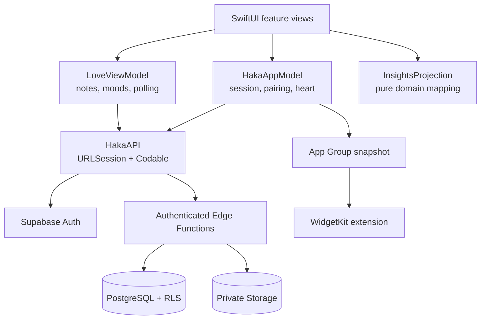

# Haka iOS — Engineering Case Study

Haka is a native iOS 16+ SwiftUI app that gives two people one private, shared heart. Both clients operate on the same server-authoritative state: taps increase the score, elapsed time decreases it, and relationship features stay scoped to the paired couple.

This document is the fastest way to review the iOS engineering work. The complete product also includes a native Android client and a shared Supabase backend.

## 30-second portfolio summary

| Signal | Evidence |
| --- | --- |
| Native iOS | Swift 5.10, SwiftUI, Swift Charts, PhotosUI, WidgetKit, AuthenticationServices |
| Architecture | Shared session/heart model, feature-owned Love state, pure domain projections, native API layer |
| Backend integration | Supabase Auth, authenticated Edge Functions, PostgreSQL/RLS, private Storage |
| UI depth | Custom heart `Shape`, clipped `Canvas` liquid animation, haptics, particles, adaptive cards |
| Accessibility | Semantic controls, VoiceOver values and hints, Reduce Motion, String Catalog foundation |
| Quality | 7 XCTest cases, deterministic domain rules, XcodeGen, GitHub Actions simulator CI |
| Current scope | Simulator-complete; physical-device signing and production APNs require Apple credentials |

## Product tour

<table>
  <tr>
    <td align="center"> <strong>Heart</strong></td>
    <td align="center"> <strong>Insights</strong></td>
    <td align="center"> <strong>Love</strong></td>
    <td align="center"> <strong>Us</strong></td>
  </tr>
</table>

## Architecture

The client submits commands rather than writing trusted values. Heart decay, tap acceptance, couple membership, rate limiting, and idempotency are enforced by the backend. iOS renders the effective decay locally from the server timestamp so the UI remains live between refreshes.

## Selected implementation map

| Concern | File | What to review |
| --- | --- | --- |
| App lifecycle and routing | [`HakaApp.swift`](../ios/Haka/App/HakaApp.swift), [`RootView.swift`](../ios/Haka/App/RootView.swift) | App delegate, notification presentation, phase routing, tab composition |
| Shared state | [`HakaAppModel.swift`](../ios/Haka/App/HakaAppModel.swift) | Session bootstrap, pairing state, heart clock, server refresh, widget projection |
| API client | [`HakaAPI.swift`](../ios/Haka/Core/HakaAPI.swift) | URLSession requests, Codable transport, auth refresh, OAuth linking, Edge Functions |
| Domain rules | [`HeartRules.swift`](../ios/Haka/Core/HeartRules.swift) | Exact 30-second boundaries, clamping, fraction and percentage calculations |
| Insights mapping | [`InsightsProjection.swift`](../ios/Haka/Core/InsightsProjection.swift) | Daily status, contribution split, deduplicated seven-day projection |
| Home composition | [`HomeView.swift`](../ios/Haka/Features/Home/HomeView.swift) | Accessible heart button, adaptive composition, feature orchestration |
| Custom graphics | [`HeartEffects.swift`](../ios/Haka/Features/Home/HeartEffects.swift) | Bézier heart path, Canvas clipping, liquid wave, particles, Reduce Motion |
| Feature state | [`LoveViewModel.swift`](../ios/Haka/Features/Love/LoveViewModel.swift) | Feature-owned state, async loading, command feedback, cancellable polling lifecycle |
| Charts and history | [`InsightsView.swift`](../ios/Haka/Features/Insights/InsightsView.swift) | Swift Charts, adaptive metrics, backend-derived daily history |
| Widget | [`HakaWidget.swift`](../ios/HakaWidget/HakaWidget.swift) | WidgetKit timeline and App Group state sharing |
| Tests | [`HakaCoreTests.swift`](../ios/Tests/HakaCoreTests.swift) | Boundary tests and deterministic projection assertions |
| CI | [`ios-ci.yml`](../.github/workflows/ios-ci.yml) | XcodeGen, dynamic simulator discovery, unsigned simulator XCTest run |

## Engineering decisions

### Server-authoritative shared state

Two people can tap concurrently and reconnect after being offline, so the client cannot safely own score calculations. The backend materializes elapsed decay with server time before applying an idempotent tap command. This prevents clock manipulation, duplicate retries, and last-write-wins corruption.

### Integer heart units

The score uses `0...10_000` integer units. One tap adds 25 points and each completed 30-second interval removes 100 points. Integer math keeps Android, iOS, SQL, tests, and widgets consistent without floating-point drift.

### Native graphics instead of a static asset

The heart is a reusable SwiftUI `Shape`. A `Canvas` clips a gradient liquid path inside it, allowing the fill level to follow backend state. The same interaction adds haptics and decorative particles while Reduce Motion switches the liquid to a static surface and suppresses particle celebrations.

### Feature-owned state where it adds value

Session, pairing, and the shared heart remain app-level concerns. Love Notes and moods have their own `LoveViewModel` and refresh lifecycle. Insights transformations are pure functions, which makes them deterministic and easy to test without UI or networking.

### Transparent platform constraints

The app is complete for Simulator development. Production remote push on iOS is intentionally not claimed: it requires an Apple Developer membership, APNs credentials, physical-device token registration, and distribution signing.

## Testing and automation

The XCTest target currently contains seven tests covering:

- Invite-code normalization
- Seconds-versus-milliseconds timestamp normalization
- Decay immediately before, at, and after a 30-second boundary
- Score clamping and percentage conversion
- Daily completion and streak mapping
- Contribution percentages, including the zero-tap case
- Seven-day filtering and authoritative replacement of today’s history entry

GitHub Actions runs on macOS, installs XcodeGen, generates the project, discovers an available iPhone Simulator, and executes the unsigned XCTest suite. Backend SQL and smoke suites separately cover authorization, pairing, idempotency, and shared-state behavior.

## Accessibility and localization

- The heart is a real `Button`, not only a gesture target.
- VoiceOver receives a label, current percentage value, and action hint.
- `ViewThatFits` keeps dense cards usable at compact widths.
- Reduce Motion removes decorative movement while preserving interaction.
- User-facing strings have an Xcode String Catalog foundation.

## Honest current tradeoffs

- Foreground iOS state currently refreshes every two seconds; Android also has direct Supabase Realtime observation.
- Android has a persisted offline tap queue; iOS currently reports failed taps instead of queueing them.
- Production APNs delivery and physical-device distribution wait on Apple Developer credentials.
- The shared Story screen is feature-rich and is the next candidate for smaller feature components and dedicated state.

These boundaries are explicit in the repository so the portfolio reflects implemented behavior rather than mock features.

## Resume-ready project bullets

- Built a native iOS 16+ relationship app in SwiftUI with a custom liquid-heart `Canvas`, Swift Charts insights, PhotosUI memories, WidgetKit, Google OAuth linking, and a shared Supabase backend.
- Implemented server-authoritative linear decay and idempotent tap commands using integer domain rules, authenticated Edge Functions, PostgreSQL/RLS, and client-side timestamp projection for responsive UI updates.
- Added VoiceOver semantics, Reduce Motion behavior, String Catalog localization, seven deterministic XCTest cases, XcodeGen project generation, and macOS simulator CI.

## Five-minute review path

1. Scan the screenshots and architecture above.
2. Read [`HeartRules.swift`](../ios/Haka/Core/HeartRules.swift) and its tests.
3. Review the accessible heart interaction in [`HomeView.swift`](../ios/Haka/Features/Home/HomeView.swift).
4. Inspect custom rendering in [`HeartEffects.swift`](../ios/Haka/Features/Home/HeartEffects.swift).
5. Follow one authenticated command through [`HakaAPI.swift`](../ios/Haka/Core/HakaAPI.swift) to the Supabase functions.

For local setup, simulator notifications, and security notes, continue to the [iOS README](../ios/README.md).
