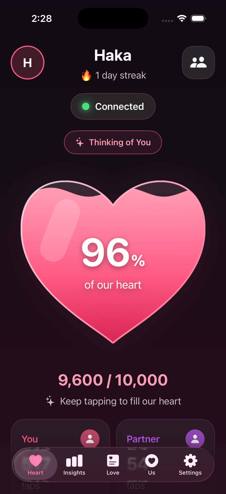
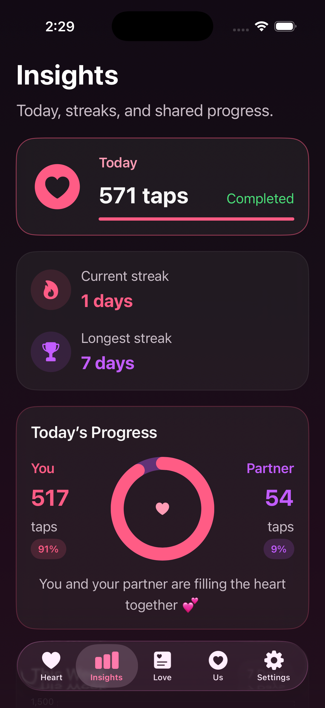
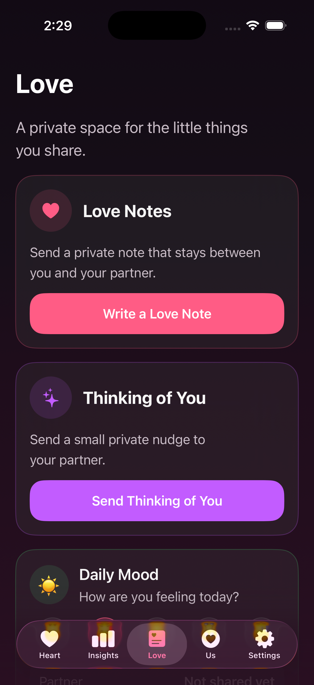
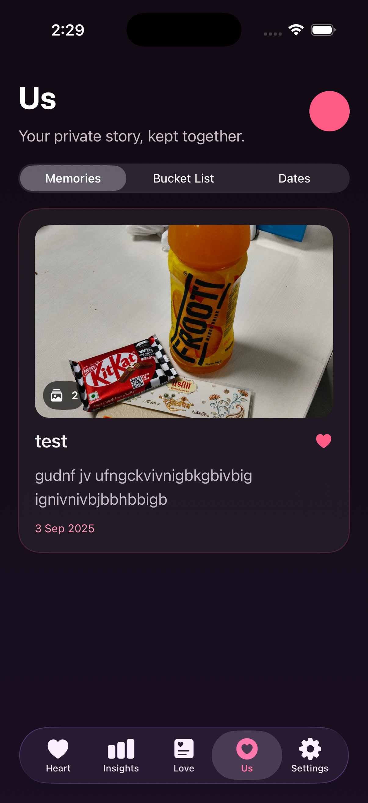

# Haka for iOS

Haka for iOS is the native SwiftUI client for Haka, a private shared-heart app for two people. It consumes the same Supabase authentication, PostgreSQL state, Edge Functions, Realtime data, and private Storage used by the Android client.

The current project runs fully in the iOS Simulator without an Apple Developer membership. Production APNs delivery, physical-device installation, TestFlight, and App Store distribution require Apple credentials later.

## Product tour

<table>
  <tr>
    <td align="center"><br /><strong>Heart</strong></td>
    <td align="center"><br /><strong>Insights</strong></td>
    <td align="center"><br /><strong>Love</strong></td>
    <td align="center"><br /><strong>Us</strong></td>
  </tr>
</table>

## Features

- Shared heart with server-authoritative taps and visible linear decay
- Live partner state refresh and automatic local decay rendering
- Thinking of You nudges, private Love Notes, and Daily Mood
- Today, contribution, streak, weekly chart, and daily-history insights
- Shared memories, private photo albums, bucket lists, and important dates
- Anonymous onboarding and Google account linking for recovery
- WidgetKit home-screen widget backed by an App Group snapshot
- VoiceOver labels and hints on the interactive shared heart
- Simulator notification fixtures for Thinking of You and Love Notes

## Architecture

```text
SwiftUI views
    │
    ├── HakaAppModel            session, pairing, heart, navigation
    ├── LoveViewModel           Love Notes, moods, feature refresh loop
    ├── InsightsProjection      pure daily and seven-day mapping
    ├── Feature views           Heart, Insights, Love, Us, Settings
    └── WidgetSnapshotStore     App Group projection for WidgetKit
            │
            ▼
HakaAPI (URLSession)
    │
    ├── Supabase Auth           anonymous + Google OAuth linking
    ├── Edge Functions          trusted commands and feature reads
    ├── PostgreSQL / RLS        authoritative couple state
    ├── Realtime                shared state changes
    └── Private Storage         memory photos
```

The client never writes trusted heart values directly. A tap carries an idempotency identifier to the backend; the Edge Function materializes elapsed decay with server time, applies the tap, clamps the score, and returns authoritative state. The app renders decay between refreshes but cannot override backend state.

### Source layout

```text
ios/
├── Config/                     local configuration template
├── Haka/
│   ├── App/                    lifecycle, root flow, shared app state
│   ├── Core/                   API, DTOs, session, notifications, theme
│   ├── Features/
│   │   ├── Auth/
│   │   ├── Home/
│   │   ├── Insights/
│   │   ├── Love/
│   │   ├── Pairing/
│   │   ├── Settings/
│   │   └── Story/
│   └── Resources/              assets, plist, entitlements
├── HakaWidget/                 WidgetKit extension
├── PushPayloads/               simulator APNs fixtures
├── Tests/                      XCTest unit tests
└── project.yml                 XcodeGen source of truth
```

## Requirements

- macOS with Xcode 16 or newer
- iOS 16+ Simulator
- [XcodeGen](https://github.com/yonaskolb/XcodeGen)
- Access to a configured Supabase project

An Apple Developer membership is not required for Simulator development.

## Configuration

1. Create the local configuration file:

   ```bash
   cd ios
   cp Config/Secrets.xcconfig.example Config/Secrets.xcconfig
   ```

2. Set the same Supabase project values used by Android:

   ```xcconfig
   SUPABASE_URL = https://your-project.supabase.co
   SUPABASE_ANON_KEY = your-publishable-or-anon-key
   ```

3. Keep `haka://auth/callback` in the Supabase Auth redirect allow-list.

`Config/Secrets.xcconfig`, `GoogleService-Info.plist`, Xcode user data, and build output are ignored by Git. Never place a Supabase service-role key in an iOS app.

## Generate, build, and run

```bash
cd ios
xcodegen generate
open HakaIOS.xcodeproj
```

Select the **Haka** scheme and an iPhone Simulator, then press Run.

For a repeatable command-line build:

```bash
xcodebuild \
  -project HakaIOS.xcodeproj \
  -scheme Haka \
  -destination 'platform=iOS Simulator,name=iPhone 16 Pro' \
  build
```

## Tests

Run the XCTest suite from Xcode with **Product > Test**, or from the command line:

```bash
xcodebuild \
  -project HakaIOS.xcodeproj \
  -scheme Haka \
  -destination 'platform=iOS Simulator,name=iPhone 16 Pro' \
  test
```

The test target currently covers invite formatting, timestamp normalization, exact decay boundaries and clamping, daily-status and streak mapping, contribution percentages, and authoritative seven-day insight projection. Backend idempotency and authorization are additionally exercised by the Supabase SQL and smoke-test suites at the repository root.

## Simulator notifications

Simulator payload injection verifies notification presentation and deep-link behavior without APNs credentials:

```bash
xcrun simctl push booted com.haka.app.ios PushPayloads/thinking-of-you.apns
xcrun simctl push booted com.haka.app.ios PushPayloads/love-note.apns
```

This does not test the production Supabase/FCM/APNs delivery route. Production iOS push requires an Apple Developer membership, APNs key, Push Notifications entitlement, and backend token registration.

## Accessibility and UI

- The heart exposes a VoiceOver label, current percentage value, and activation hint.
- Reduce Motion keeps the liquid surface static and suppresses decorative tap and full-heart particles.
- Native `Button`, `TabView`, `NavigationStack`, `Chart`, and `PhotosPicker` controls preserve platform semantics.
- Semantic colors and reusable card/button styles live in `HakaTheme.swift`.
- Layouts use adaptive SwiftUI containers rather than fixed Android dimensions.

## Security model

- Supabase anon/publishable keys identify the public client and are protected by RLS; they are not administrative credentials.
- Supabase service-role credentials and Firebase service-account material remain backend-only.
- Sessions are restored through the native session store.
- Couple-scoped reads and writes are enforced by backend membership checks.
- Memory media is stored in private Supabase Storage and accessed with authenticated URLs.

## Current platform boundary

Everything in the app can be developed and exercised in Simulator except production APNs delivery and distribution to physical iPhones. Once Apple credentials are available, the remaining release work is signing, capabilities, device token registration, APNs routing, TestFlight, and App Store metadata—not an application rewrite.
